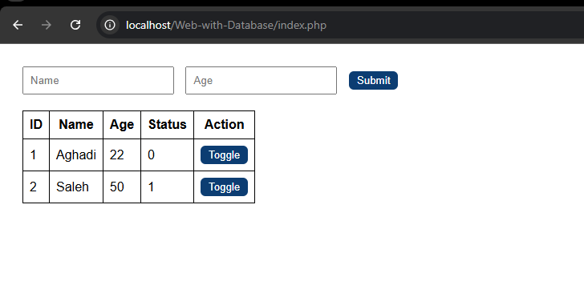
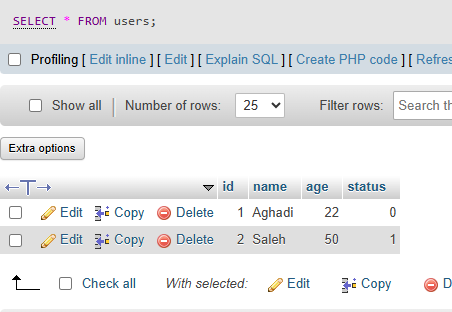

# Web Form  

**Project Title**  
User Submission and Status Toggle System

---

## Objective  
The objective of this project is to build a responsive web application that allows users to submit their name and age through a form. The submitted data is saved to a MySQL database and displayed in a dynamic table with real-time status toggling. The project demonstrates full-stack development using HTML, CSS, PHP, and MySQL.

---

## Description  
The project consists of the following key components:

### User Form  
A clean, single-line form for inputting:
- **Name** (text field)
- **Age** (number field)
- **Submit** button

### Records Table  
Displays all user submissions in a structured table format showing:
- ID  
- Name  
- Age  
- Status (0 or 1)  
- Action (toggle button to switch status)

### Toggle Functionality  
Each record includes a **Toggle** button:
- Changes the user’s status between 0 and 1
- Updates are reflected immediately on the interface after clicking

---

## Key Features:
- Clean table view with real-time status switching
- CSS animations for smoother interactions
- Modular PHP structure for maintainability

---

## Tools and Platform  
- **Platform**: Visual Studio Code, XAMPP (Apache + MySQL)  
- **Languages**: HTML5, CSS3, PHP  
- **Database**: MySQL (via phpMyAdmin)  
- **Design Techniques**:
  - CSS transitions for button hover
  - Reusable class styling
  - Separation of logic using `db.php`, `toggle.php`, and `style.css`

---

## Project Screenshot  
Below are screenshots demonstrating the interface and features:

- **Form Interface**  
  

- **User Table**  
  

---

## Created By  
- **Name**: Aghadi Saleh Al-rebdi   
- **Department**: Computer Science  
- **Year**: 2025  

